# Barnabee - Embodied AI Intelligence System

**An open-source, proactive intelligence assistant designed to perceive, think, and act in the physical world.**

Barnabee is a modular AI system that starts with home automation and voice interaction, but is architected to grow into a fully embodied intelligence capable of robotic control and complex environmental interaction. Built on the human-analog model with distinct sensory, cognitive, and motor systems.

## 🎯 Core Vision & Philosophy

**Primary Goal**: Create an AI with human-like sensory perception, cognitive processing, memory systems, and the ability to interact with and shape its environment through proactive intelligence.

### Design Principles
- **Modularity**: Each component (input clients, Node-RED brain, databases, AI models) is distinct and replaceable
- **Node-RED as Central Brain**: Visual programming paradigm provides transparent, maintainable intelligence orchestration
- **Separation of Concerns**: Clients capture input, Node-RED processes decisions, external services handle specialized tasks
- **Family-Safe Design**: Built for multi-person households with privacy, safety, and "suggest don't assume" philosophy

## 🏗️ System Architecture (Human Analog Model)

```mermaid
graph TD
    subgraph "Senses (Input Systems)"
        Visual["📷 Visual<br/>Cameras, image processing"]
        Auditory["🎧 Auditory<br/>Smart glasses, microphones"]
        Tactile["🤚 Tactile<br/>Environmental sensors"]
        Interoception["🫀 Interoception<br/>System monitoring, logs"]
    end
    
    subgraph "Brain (Processing & Intelligence)"
        Thoughts["🧠 Node-RED Flows<br/>Decision making"]
        Intelligence["🤖 LLM Integration<br/>Local and cloud AI"]
        Memory["💾 Memory Systems<br/>Sensory, short-term, long-term"]
        Learning["📚 Pattern Recognition<br/>Behavioral adaptation"]
    end
    
    subgraph "Appendages (Action Systems)"
        HomeControl["🏠 Home Assistant<br/>Device control"]
        Automation["⚙️ Extended Platforms<br/>Automation systems"]
        Robotics["🤖 Future Robotics<br/>Physical manipulation"]
    end
    
    subgraph "Voice (Communication)"
        Audio["🔊 Audio Output<br/>Speakers throughout environment"]
        Visual2["📱 Visual Output<br/>Notifications, dashboards"]
        Digital["📧 Digital Communication<br/>Email, text, calls"]
    end
    
    Visual --> Thoughts
    Auditory --> Thoughts
    Tactile --> Thoughts
    Interoception --> Thoughts
    
    Thoughts --> Intelligence
    Intelligence --> Memory
    Memory --> Learning
    Learning --> Thoughts
    
    Thoughts --> HomeControl
    Thoughts --> Automation
    Thoughts --> Robotics
    
    Thoughts --> Audio
    Thoughts --> Visual2
    Thoughts --> Digital
```



### Current Implementation Architecture

```mermaid
graph TD
    User -->|Voice| MentraOS["👓 Mentra OS App<br/>(Wake Word Detection)"]
    
    MentraOS -->|Commands Only| NodeRED["🧠 Node-RED Brain"]
    MentraOS -->|All Text| UniversalLogger["📝 Universal Logger"]
    
    UniversalLogger --> SQLite["💾 SQLite Database<br/>(All Conversations)"]
    
    NodeRED --> CommandRouter["🚦 Command Router"]
    
    CommandRouter -->|Time/Math/Jokes| InstantCache["⚡ Instant Cache<br/>(0ms latency)"]
    CommandRouter -->|Complex| AzureAI["☁️ Azure OpenAI<br/>(GPT-4.1-nano)"]
    CommandRouter -->|Devices| HomeAssistant["🏠 Home Assistant<br/>(Planned)"]
    
    InstantCache --> Response["💬 Response"]
    AzureAI --> Response
    HomeAssistant --> Response
    
    Response --> MentraOS
    SQLite --> Dashboard["📊 Real-time Dashboard"]
```



## 🚀 Current Capabilities & Status

### ✅ Working Features

#### Advanced Voice Processing Pipeline
- **Enhanced Local Wake Word Detection**: 
  - Supports "barnabee", "barnaby", "barney" with advanced fuzzy matching
  - 50% error tolerance using optimized Levenshtein distance algorithm
  - 80% reduction in unnecessary Node-RED calls through local pre-filtering
  - Confidence scoring (60-100%) with exact/fuzzy/phonetic matching types
  - Phonetic variation mapping for better speech recognition accuracy

#### Optimized Client Architecture (AugmentOS Glasses App)
- **TypeScript Implementation**: Full type safety with `@augmentos/sdk` integration
- **Performance Optimizations**:
  - Connection keep-alive with optimized HTTP client (3x faster requests)
  - Sub-100ms wake word detection with real-time visual feedback
  - Smart timeout handling (3s) for faster failure detection
  - Connection pooling and reuse for consistent performance
- **Enhanced User Experience**:
  - Real-time visual indicators (⚡🚀💭🤔) based on response speed
  - Smart display duration based on content length and processing time
  - Instant acknowledgment followed by detailed responses
  - Context-aware error messages for different failure types

#### Intelligent Processing Pipeline
- **Universal Text Logging**: ALL transcriptions sent to Node-RED (commands + ambient)
- **Smart Visual Feedback**: Only shows responses for commands, silent logging for ambient
- **Multi-Tier Response Classification**:
  - ⚡ Instant responses (<10ms): Lightning bolt indicator
  - 🚀 Fast responses (<100ms): Rocket indicator  
  - 💭 AI responses (<1000ms): Thinking indicator
  - 🤔 Slow responses (>1000ms): Pondering indicator
- **Performance Monitoring**: 
  - Real-time processing time measurement
  - Memory usage alerts (150MB threshold)
  - Node-RED health checks every 60 seconds
  - Automatic slow response warnings for optimization

#### Performance Metrics (Current)

| Metric | Target | Current Performance | Implementation |
|--------|--------|--------------------|--------------------|
| Wake Word Detection | <100ms | <100ms ✅ | Local Levenshtein algorithm |
| Instant Responses | <10ms | ~8-10ms ✅ | Client-side indicators |
| Node-RED Commands | <500ms | ~340ms ✅ | Optimized HTTP client |
| AI Queries | <2s | 500-2000ms ✅ | Azure OpenAI integration |
| Memory Usage (Client) | <200MB | 50-150MB ✅ | 30s monitoring intervals |
| HTTP Connection Reuse | 3x faster | ✅ | Keep-alive optimization |
| Wake Word Accuracy | >90% | 60-100% ✅ | Exact + fuzzy matching |

#### Debugging and Monitoring Tools

**Real-Time Performance Logging**:
```typescript
console.log(`[PROCESSING] "${transcription.text}"`);
console.log(`[RESPONSE] ${processingTime.toFixed(1)}ms: "${reply}"`);
console.log(`[MEMORY] Usage: ${memoryMB}MB`);
console.log(`[HEALTH CHECK] Node-RED: OK`);
```

**Visual Debug Indicators**:
- **⚡** Instant responses (<10ms) - Lightning fast
- **🚀** Fast responses (<100ms) - Rocket speed  
- **💭** AI responses (<1000ms) - Thinking process
- **🤔** Slow responses (>1000ms) - Deep pondering
- **🧠** Wake word detected - Brain activation

**Automated Health Monitoring**:
- Memory usage alerts at 150MB threshold
- Node-RED connectivity checks every 60 seconds
- Performance warnings for >2 second responses
- Connection failure detection and reporting

**Error Classification System**:
- `ECONNABORTED`: Timeout errors → "Node-RED is slow"
- `ECONNREFUSED`: Connection errors → "Can't connect to Node-RED"  
- `500`: Server errors → "Node-RED internal error"
- `404`: Endpoint errors → "Node-RED endpoint not found"

## 🏗️ Hardware Architecture

### Production Server (Beelink Mini PC EQi12)
- **CPU**: Intel Core 1220P (Max 4.4GHz, 10C/12T)
- **RAM**: 16GB DDR4
- **Storage**: 500GB PCIe 4.0 SSD
- **Network**: Dual LAN/WiFi6/BT5.2
- **Role**: 24/7 Barnabee server
- **Location**: `/opt/barnabee/` directory

### Development Machine (Gaming Rig)
- **CPU**: Intel i9-14900KF
- **GPU**: NVIDIA GeForce RTX 4070 Ti (12GB VRAM)
- **RAM**: 128GB
- **Role**: Development, debugging, optional heavy AI processing

## 📁 Project Structure

```
/opt/barnabee/
├── docker-compose.yml              # Service orchestration
├── README.md                       # This file
└── data/                          # Persistent data directory
    ├── augmentos-app/             # Mentra OS voice client (AugmentOS glasses)
    │   ├── index.ts               # Main application with enhanced wake word detection
    │   ├── .env                   # Environment configuration
    │   ├── package.json           # Dependencies (@augmentos/sdk, axios, dotenv)
    │   └── dist/                  # Compiled JavaScript
    ├── nodered/                   # Node-RED persistent data
    │   ├── full_memory_log.db     # SQLite conversation database
    │   ├── flows.json             # Node-RED flow configuration
    │   └── settings.js            # Node-RED configuration
    └── migrations/                # Database schema migrations
        └── *.sql                  # Version-controlled schema changes
```

## 🛠️ Installation & Setup

### Prerequisites
- **Runtime**: Node.js 18+, Bun (for AugmentOS client)
- **Services**: Docker & Docker Compose
- **Accounts**: Azure OpenAI API access, AugmentOS API key
- **Optional**: Ollama (for local AI), Home Assistant

### Quick Setup

1. **Clone and Install**:
   ```bash
   cd /opt/barnabee/
   git clone <repository-url> .
   cd data/augmentos-app/
   bun install
   ```

2. **Configure Environment**:
   ```bash
   # data/augmentos-app/.env
   PACKAGE_NAME=com.thomahawk.interpresai
   PORT=3000
   AUGMENTOS_API_KEY=your_api_key_here
   NODERED_URL=http://localhost:1880/voice-input
   ```

3. **Start Services**:
   ```bash
   docker-compose up -d
   cd data/augmentos-app/
   bun run index.ts
   ```

4. **Initialize Database**:
   - Open Node-RED: `http://localhost:1880`
   - Navigate to Database Management tab
   - Click "First Create Table"

## 🔧 Configuration

#### Code Implementation Highlights

**Enhanced Wake Word Detection Class**:
```typescript
class EnhancedWakeWordDetector {
    private wakeWords = ['barnabee', 'barnaby', 'barney'];
    private phoneticMap: Map<string, string[]>;
    
    // Optimized Levenshtein distance for fuzzy matching
    private levenshteinDistance(a: string, b: string): number {
        // Efficient dynamic programming implementation
        // Allows 50% error tolerance for speech recognition variations
    }
    
    detectWakeWordAndCommand(text: string): WakeWordResult {
        // 1. Exact match (100% confidence)
        // 2. Fuzzy match (60-95% confidence) 
        // 3. Phonetic variations for common mispronunciations
    }
}
```

**Optimized HTTP Client**:
```typescript
const nodeRedClient = axios.create({
    baseURL: NODERED_URL.split('/voice-input')[0],
    timeout: 3000,
    headers: {
        'Connection': 'keep-alive',
        'Keep-Alive': 'timeout=5, max=1000'
    },
    maxRedirects: 0
});
```

**Smart Visual Feedback System**:
```typescript
// Performance-based visual indicators
if (processingTime < 10) {
    displayText = `⚡ ${reply}`; // Lightning for instant
} else if (processingTime < 100) {
    displayText = `🚀 ${reply}`; // Rocket for fast
} else if (processingTime < 1000) {
    displayText = `💭 ${reply}`; // Thinking for AI
} else {
    displayText = `🤔 ${reply}`; // Pondering for slow
}
```

**Comprehensive Error Handling**:
```typescript
// Context-aware error messages
if (err.code === 'ECONNABORTED') {
    errorMessage = "Response timeout - Node-RED is slow";
} else if (err.code === 'ECONNREFUSED') {
    errorMessage = "Can't connect to Node-RED";
} else if (err.response?.status === 500) {
    errorMessage = "Node-RED internal error";
}
```

### Memory System Schema
```sql
CREATE TABLE full_memory_log (
    id INTEGER PRIMARY KEY,
    timestamp TEXT NOT NULL,
    type TEXT NOT NULL,              -- 'voice_command' or 'ambient_text'
    source TEXT NOT NULL,            -- 'mentra_os' or other sources
    userId TEXT,
    sessionId TEXT,
    content_text TEXT,               -- Full transcription
    metadata TEXT,                   -- JSON with confidence, wakeWord, etc.
    processed_status TEXT DEFAULT 'pending',
    memory_tier TEXT DEFAULT 'full',
    relevance_score REAL DEFAULT 0.0
);
```

## 📡 API Endpoints

### Voice Input
```http
POST /voice-input
Content-Type: application/json

{
  "originalText": "Barnabee, turn on the lights",
  "command": "turn on the lights",
  "hasWakeWord": true,
  "wakeWord": "barnabee",
  "sessionId": "session-123",
  "userId": "user@example.com",
  "confidence": 0.95
}
```

### Proactive Notifications
```http
POST /notify
Content-Type: application/json

{
  "message": "Motion detected at front door",
  "title": "Security Alert",
  "priority": "urgent"
}
```

### Health Check
```http
GET /health

Response: 200 OK
{
  "status": "healthy",
  "uptime": "2d 14h 32m",
  "memory_usage": "145MB",
  "last_command": "2024-01-15T10:30:00Z"
}
```

## 🚨 Security Considerations

### ⚠️ Known Security Issue
**Azure OpenAI API Key**: Currently hardcoded in Node-RED flow due to Docker networking limitations. Multiple proxy solutions attempted and failed.

### Current Security Measures
- **Azure-Side Controls**: 
  - Spending limits in Azure Portal
  - IP allowlisting for home network
  - Dedicated API key for Barnabee only
- **Local Security**:
  - Never commit flows to public repositories
  - Monthly API key rotation
  - Usage monitoring through Azure Portal
- **Minimal Exposure**: Only processed commands sent to external services
- **Audit Trail**: Complete logging for security monitoring

### Future Solutions
- Run Node-RED directly on host (outside Docker)
- Implement dedicated secrets management service
- Use Docker Compose networking improvements

## 🧠 Memory Management System

### Current Memory Tiers
1. **Full Memory Log** ✅ (All interactions with rich metadata)
2. **Short-Term Memory** 🔄 (In-memory working context)
3. **Conversation Memory** 🔄 (Session-based continuity)
4. **Long-Term Memory** 📋 (Summarized knowledge storage)
5. **Core Memory** 📋 (Permanent system knowledge)

### Planned Memory Features
- **Contextual Recall**: "What did I ask about the greenhouse yesterday?"
- **Pattern Recognition**: "You usually turn off the office light at 5:30pm"
- **Proactive Suggestions**: "The garage has been open for 30 minutes"
- **Learning Integration**: Failed commands → improved responses

## 🎯 Development Roadmap

### Phase 1: Enhanced Status & Query (Priority)
```javascript
// Status Query Engine
"Is the garage door open?" → entity state mapping → conversational response

// Complex Command Processor
"Turn off all lights except the bedroom"
"If it's after sunset, turn on the porch light"
```

### Phase 2: Context & Intelligence
- **Home Context Manager**: Device relationships, room layouts, user preferences
- **Historical Data Interface**: "What was the temperature yesterday at 3pm?"
- **Usage Analytics**: Patterns, insights, optimization suggestions

### Phase 3: AI Integration
- **Ollama Integration**: Local LLM for privacy-focused conversations
  - Recommended: `phi3.5:3.8b-mini-instruct-q4_K_M` (~2GB)
  - Alternative: `qwen2.5:3b-instruct-q4_K_M` (~2.5GB)
- **Command Learning**: Track failures, learn corrections, improve over time

### Phase 4: Advanced Features
- **Proactive Intelligence**: Context-aware suggestions and reminders
- **Automation Creation**: Voice-driven automation setup
- **Multi-Modal Input**: Voice + vision + sensor integration
- **Collaborative AI**: Multi-user household support

## 🧪 Testing & Development

### Available Test Commands
Node-RED includes test inject nodes for:
- 💡 Light control (on/off)
- 🌡️ Temperature control
- 🎵 Media control
- 🤖 AI queries
- ⏰ Time queries
- 😂 Joke requests
- 🔢 Math calculations

### Performance Monitoring
- Response times for each processing path
- Memory usage (logged every 30 seconds)
- Node-RED health status (checked every 60 seconds)
- Command success/failure rates

### Debug Mode
Enable detailed logging through Node-RED debug nodes:
- 🔍 Universal Receiver Output
- 🎯 Command Handler Output
- 📤 AI Request/Response
- ⚡ Instant Response logs

## 🚀 Deployment Process

### Production Deployment
1. Update code in `/opt/barnabee/data/augmentos-app/`
2. Build: `npm run build` or `bun run build`
3. Restart: `pm2 restart barnabee`
4. Monitor: `pm2 logs barnabee`

### Version Control Strategy
- **Node-RED Flows**: Export to `flows.json` with each change
- **Database Schema**: Version migrations in `migrations/` directory
- **Environment Config**: Template files with secure defaults

## 📋 AI Assistant Instructions

### Core Philosophy for AI Collaboration
When working with Barnabee, always remember: **Barnabee is a human analog**. Like a human, it has:
- **Senses** (cameras, microphones, sensors) to perceive the environment
- **A Brain** (Node-RED + AI) to process and think about what it perceives
- **Memory** (multiple types like humans: sensory, short-term, long-term, procedural, episodic)
- **The Ability to Speak** (voice output, notifications, digital communication)
- **Appendages** (smart devices, future robotics) to interact with and change the physical world

The goal is not just home automation, but **embodied artificial intelligence** that can eventually think, learn, and act autonomously in the physical world.

### Essential Guidelines for New Conversations

1. **ALWAYS Update This README**: This is the single source of truth. Any code changes, architectural decisions, or new insights must be reflected here immediately.

2. **Respect the Human-Analog Architecture**: 
   - Senses → Brain → Memory → Action
   - Design for continuous operation, not discrete tasks
   - Think about how a human would approach the same problem

3. **Keep the Long-Term Vision in Mind**:
   - Current: Smart home automation with voice control
   - Near-term: Proactive intelligence and learning
   - Long-term: Fully embodied AI with robotic capabilities
   - End goal: AI that can perceive, think, learn, and act like a human

4. **Prioritize the Family Context**:
   - 6 people (2 adults, 4 children) + 2 cats
   - Children's privacy is absolute (no cameras/mics in bedrooms)
   - Must work perfectly for guests with zero explanation
   - "Magic" means anticipation without intrusion

5. **Performance is Non-Negotiable**:
   - <50ms for instant responses
   - <2 seconds for any user interaction
   - Always provide immediate acknowledgment
   - Fail gracefully, never leave user hanging

### Current Project Focus Areas

**Phase 1: Enhanced Intelligence (Current)**
- Status query engine ("Is the garage door open?")
- Complex command processing ("Turn off all lights except bedroom")
- Pattern learning and caching system
- Proactive suggestions based on observed patterns

**Phase 2: Advanced Cognition (Next)**
- Autonomous mind that continuously observes and reflects
- Curiosity engine for contextual questions
- Multi-modal sensing integration
- Predictive behavior patterns

**Phase 3: Embodied Actions (Future)**
- Robotic integration for physical manipulation
- Mobile platforms for movement
- Advanced environmental interaction
- Multi-location presence

### Technical Development Guidelines

1. **Architecture Decisions**:
   - Modular design: every component should be replaceable
   - Local-first: critical functions work without internet
   - Real-time: continuous processing, not batch jobs
   - Extensible: designed to grow from home automation to full embodiment

2. **Code Standards**:
   - TypeScript for type-safe client development
   - Environment variables for all configuration
   - Comprehensive error handling with user feedback
   - Performance monitoring built into every component

3. **Testing Approach**:
   - Family scenarios: How does this work with kids' friends over?
   - Guest scenarios: Can someone figure this out instantly?
   - Failure scenarios: What happens when internet/power fails?
   - Privacy scenarios: Does this respect boundaries?

### Common Development Tasks

**Adding Voice Commands**:
- Update Node-RED command router
- Add to instant cache if simple
- Create learning patterns for AI fallback
- Test with natural variations

**Integrating New Sensors**:
- Map to human-analog sense type
- Define data flow through processing pipeline
- Consider privacy implications
- Plan for presence detection integration

**Enhancing Memory Systems**:
- Extend SQLite schema thoughtfully
- Consider retention and privacy policies
- Design for cross-memory queries
- Plan learning and forgetting mechanisms

**Performance Optimization**:
- Profile every component
- Cache aggressively
- Parallel processing where possible
- Monitor and alert on degradation

### Conversation Development Log

*This section tracks major decisions and progress from recent development sessions.*

#### Current Status (December 2024)

**✅ Completed**:
- Universal voice receiver logging ALL text (commands + ambient)
- Smart command router with multiple processing paths (instant/cached/HA/AI)
- Wake word detection with fuzzy matching (50% error tolerance)
- Azure OpenAI integration for complex queries
- SQLite database with comprehensive conversation logging
- Performance monitoring and HTTP notification system

**🚧 In Progress**:
- Status query handler for device state questions
- Complex command processor ("all except" patterns)
- Pattern learning cache system for AI-to-local promotion
- Family presence detection logic

**📋 Next Priority**:
- Home Assistant device inventory and integration
- Conditional logic processing ("if X then Y")
- Historical data query interface
- Proactive suggestion engine

#### Architecture Decisions Made

1. **Two-Path Processing**: Commands get responses, ambient text gets logged silently
2. **Client-Side Wake Word**: Eliminates round trips, 80% reduction in server calls
3. **Smart Routing**: Different command types go to optimal processors
4. **Everything Logged**: Both commands and ambient text for learning
5. **Hybrid Intelligence**: Local for speed, AI for complexity

#### Research Insights

**Home Assistant Built-in Assist Limitations**:
- No device status queries ("Is garage open?")
- No complex multi-device commands ("all except")
- No conditional logic or historical data access
- Requires exact entity names, no natural language flexibility

**AI Integration Strategy**:
- Ollama: Local privacy, requires 6-16GB RAM, 50-80% accuracy
- ChatGPT: Maximum capability, cloud privacy concerns, ongoing costs
- Hybrid approach optimal: local for simple, AI for complex

#### Performance Metrics (Current)
- Instant responses: ~8-10ms
- Home Assistant commands: ~340ms average
- AI queries: 500-2000ms
- Wake word detection: 60-100% accuracy (fuzzy matching)
- Memory usage: 50-150MB (client), 200-400MB (Node-RED)

#### Code Snippets Ready for Implementation

**Status Query Handler**:
```javascript
function checkDeviceStatus(command) {
    const patterns = [
        { regex: /is (?:the )?(.+?) (?:turned |switched )?on/i, type: 'binary' },
        { regex: /what(?:'s| is) (?:the )?temperature (?:in |of )?(?:the )?(.+)/i, type: 'sensor' }
    ];
    // Map natural language to entity states
    return formatConversationalResponse(entityState);
}
```

**Pattern Learning System**:
```sql
CREATE TABLE command_patterns (
    normalized_pattern TEXT,
    action_template TEXT,
    confidence REAL DEFAULT 0.0,
    usage_count INTEGER DEFAULT 1
);
```

#### Development Priorities This Week

1. **Status Query Engine**: Handle "Is X open/on?" with natural language mapping
2. **Complex Commands**: Process "all except" patterns and multi-device operations
3. **Learning Cache**: Implement AI-to-local pattern promotion
4. **Testing Framework**: Family and guest scenario validation

### Memory and Learning Architecture

Barnabee implements a complete human-analog memory system:

**Memory Types**:
- **Sensory Memory**: 0-3 second input buffers
- **Short-Term Memory**: 1-30 minute working context
- **Long-Term Memory**: Permanent pattern storage
- **Procedural Memory**: Learned skills and automations
- **Episodic Memory**: Event sequences with temporal context

**Learning Pipeline**:
- Pattern detection from successful AI interactions
- Confidence scoring and usage tracking
- Automatic cleanup of poor patterns
- Privacy-preserving anonymous pattern storage

### Autonomous Mind Development

Beyond reactive responses, Barnabee is developing autonomous cognition:

**Background Processes**:
- Continuous pattern observation
- User availability detection
- Contextual curiosity generation
- Proactive suggestion timing

**Personality Framework**:
- Curiosity: 0.7 (asks questions but not annoying)
- Helpfulness: 0.9 (very eager to help)
- Patience: 0.95 (waits for right moment)
- Confidence: 0.6 (suggests, doesn't insist)

### Critical Reminders

**Security Considerations**:
- Azure OpenAI API key currently hardcoded in Node-RED (known issue)
- Multiple proxy solutions attempted and failed due to Docker networking
- Current mitigation: Azure-side spending limits and IP restrictions
- Never commit flows to public repositories

**Privacy Boundaries**:
- Children's bedrooms: Basic sensors only, no cameras/mics
- Bathrooms: Minimal sensing, no recording
- Conversations: Process and delete, store intents only
- Learning: Anonymous patterns only, no personal identification

### Future Vision Implementation

**Path to Emergent Cognition**:
- Phase 1: Rule-based with AI assistance (current)
- Phase 2: Continuous processing with background cognition
- Phase 3: Neural components replacing hardcoded rules
- Phase 4: True autonomous goal formation and learning

**Embodiment Roadmap**:
- Current: Smart home device control
- Next: Advanced sensor fusion and environmental awareness
- Future: Mobile robotic platforms and physical manipulation
- Goal: Full embodied intelligence capable of independent operation

Remember: We're not just building a smart home system. We're laying the foundation for embodied artificial intelligence that will eventually perceive, think, learn, and act in the physical world like a human.

## 🌟 Future Vision

### Advanced Capabilities
- **Embodied Robotics**: Physical manipulation and movement
- **Environmental Awareness**: Full sensory integration (vision, touch, smell)
- **Predictive Intelligence**: Anticipatory actions based on learned patterns
- **Emotional Intelligence**: Context-aware, empathetic responses

### Integration Expansions
- **Calendar Sync**: Google Calendar, scheduling intelligence
- **Message Processing**: Email and SMS analysis and response
- **IoT Ecosystem**: Motion, temperature, door sensors, smart devices
- **External APIs**: Weather, news, traffic, social media

### AI Enhancements
- **Hybrid Processing**: Intelligent local vs. cloud AI routing
- **Memory Consolidation**: Automatic knowledge extraction and summarization
- **Multi-Modal Understanding**: Voice + vision + text + sensor fusion
- **Collaborative Learning**: Household-wide behavior and preference learning

---

**This README serves as the definitive specification and living documentation for Barnabee.** Any developer or AI assistant should be able to understand the complete project state and make accurate modifications by reading this document alone.

**Last Updated**: December 2024  
**Current Version**: 1.0.0-beta  
**Next Major Release**: 1.1.0 (Home Assistant Integration)

---

*Barnabee - Building the future of embodied artificial intelligence, one conversation at a time.*