# Barnabee - Embodied AI Intelligence System

**An open-source, proactive intelligence assistant designed to perceive, think, and act in the physical world.**

Barnabee is a modular AI system that starts with home automation and voice interaction, but is architected to grow into a fully embodied intelligence capable of robotic control and complex environmental interaction. Built on the human-analog model with distinct sensory, cognitive, and motor systems.

## 🎯 Core Vision & Philosophy

**Primary Goal**: Create an AI with human-like sensory perception, cognitive processing, memory systems, and the ability to interact with and shape its environment through proactive intelligence.

### Design Principles
- **Modularity**: Each component (input clients, Node-RED brain, databases, AI models) is distinct and replaceable
- **Node-RED as Central Brain**: Visual programming paradigm provides transparent, maintainable intelligence orchestration
- **Separation of Concerns**: Clients capture input, Node-RED processes decisions, external services handle specialized tasks
- **Family-Safe Design**: Built for multi-person households with privacy, safety, and "suggest don't assume" philosophy

## 🏗️ System Architecture (Human Analog Model)


### Current Implementation Architecture

```mermaid
graph TD
    User -->|Voice| MentraOS["👓 Mentra OS App<br/>(Wake Word Detection)"]
    
    MentraOS -->|Commands Only| NodeRED["🧠 Node-RED Brain"]
    MentraOS -->|All Text| UniversalLogger["📝 Universal Logger"]
    
    UniversalLogger --> SQLite["💾 SQLite Database<br/>(All Conversations)"]
    
    NodeRED --> CommandRouter["🚦 Command Router"]
    
    CommandRouter -->|Time/Math/Jokes| InstantCache["⚡ Instant Cache<br/>(0ms latency)"]
    CommandRouter -->|Complex| AzureAI["☁️ Azure OpenAI<br/>(GPT-4.1-nano)"]
    CommandRouter -->|Devices| HomeAssistant["🏠 Home Assistant<br/>(Planned)"]
    
    InstantCache --> Response["💬 Response"]
    AzureAI --> Response
    HomeAssistant --> Response
    
    Response --> MentraOS
    SQLite --> Dashboard["📊 Real-time Dashboard"]
```



## 🚀 Current Capabilities & Status

### ✅ Working Features

#### Advanced Voice Processing Pipeline
- **Enhanced Local Wake Word Detection**: 
  - Supports "barnabee", "barnaby", "barney" with advanced fuzzy matching
  - 50% error tolerance using optimized Levenshtein distance algorithm
  - 80% reduction in unnecessary Node-RED calls through local pre-filtering
  - Confidence scoring (60-100%) with exact/fuzzy/phonetic matching types
  - Phonetic variation mapping for better speech recognition accuracy

#### Node-RED Brain (Current Implementation)
- **Universal Text Logging**: ALL transcriptions stored in SQLite with metadata
- **Smart Command Router**: Multi-tier processing with instant/cached/AI paths
- **Instant Response Cache**: Time queries, jokes, basic greetings (<10ms)
- **Azure OpenAI Integration**: Complex query fallback with GPT-4.1-nano
- **Performance Monitoring**: Response times, memory usage, health checks
- **Barnabee Assistant Event Handling**: Captures memory logs, learning patterns, and device queries
- **Performance Testing Framework**: Built-in comparison between Assist API and direct service calls

#### Node-RED Testing & Analytics Infrastructure

**Performance Comparison Testing**:
```javascript
// Built-in test flows for measuring HA Assist vs Direct API performance
ASSIST PATH (Conversation API):
  Tests: 10
  Average: 340ms
  Min: 285ms
  Max: 450ms
  
DIRECT PATH (Service Call):
  Tests: 10
  Average: 45ms
  Min: 35ms
  Max: 65ms
  
DIFFERENCE: 295ms
FASTER: DIRECT
```

**Barnabee Assistant Event Integration**:
- **Memory Events**: Captures `barnabee_assistant.memory.logged` events for learning
- **Pattern Learning**: Processes successful AI interactions for future rule creation
- **Device Query Analytics**: Tracks device status queries and responses
- **Automatic Pattern Analysis**: Extracts potential command patterns for caching

**Event-Driven Learning Pipeline**:
```javascript
// Three event types captured from Barnabee Assistant:
1. Memory Logs: User preferences and context storage
2. Learning Patterns: Successful AI interactions for rule generation
3. Device Queries: Natural language device status requests

// All events stored in full_memory_log.db with different memory_tier classifications:
- memory: Explicit user preferences and context
- pattern: Potential command rules extracted from AI interactions
- queries: Device status query analytics
- rules: Generated patterns ready for instant response caching
```

#### Optimized Client Architecture (AugmentOS Glasses App)
- **TypeScript Implementation**: Full type safety with `@augmentos/sdk` integration
- **Performance Optimizations**:
  - Connection keep-alive with optimized HTTP client (3x faster requests)
  - Sub-100ms wake word detection with real-time visual feedback
  - Smart timeout handling (3s) for faster failure detection
  - Connection pooling and reuse for consistent performance
- **Enhanced User Experience**:
  - Real-time visual indicators (⚡🚀💭🤔) based on response speed
  - Smart display duration based on content length and processing time
  - Instant acknowledgment followed by detailed responses
  - Context-aware error messages for different failure types

#### Home Assistant Integration (Barnabee Assistant)
- **Smart Routing Architecture**: HA-first approach with intelligent fallbacks
  - **Step 1**: Try Home Assistant built-in conversation agent first
  - **Step 2**: Use instant Barnabee responses for common queries
  - **Step 3**: Fallback to Node-RED for complex processing
  - **Step 4**: Graceful error handling with helpful messages
- **Multi-Modal Input Services**:
  - `voice_process`: General voice input from any source
  - `email_process`: Email content analysis and response
  - `glasses_process`: AR glasses with ambient context enhancement
  - `notification_process`: Proactive notifications requiring responses
- **Advanced Function Capabilities**:
  - Native Home Assistant service execution
  - Device status queries with natural language
  - Memory logging for learning and context
  - SQLite database integration for historical queries
  - Template, script, REST, and composite function types

### ⚠️ Current Issues & Limitations

#### Critical Problems Requiring Immediate Attention

**1. Wake Word Processing Issues**:
- Glasses app sends full "barnabee turn off office light" to Node-RED
- Node-RED tries to process "barnabee" as part of the command
- Home Assistant integration can't handle device commands with wake word prefix
- **Fix Needed**: Proper wake word stripping in glasses app before sending to Node-RED

**2. Math Processing Failures**:
- Simple calculations getting rejected as "can't calculate"
- Math expressions not reaching AI processing layer
- Instant cache math handler too restrictive
- **Fix Needed**: Enhanced math parsing and fallback to AI for complex expressions

**3. Multi-Step Command Limitations**:
- "Turn off office light and office fan" not handled properly
- "Turn off all lights except one" fails to route to appropriate processor
- Complex commands should go to Barnabee brain, not local HA processing
- **Fix Needed**: Better command complexity detection and routing

**4. Missing Conversation Context**:
- No conversation memory between exchanges
- AI asks question → user responds → system has no context of previous question
- No session continuity or follow-up management
- **Fix Needed**: Implement conversation memory and context tracking

#### Architectural Gaps

**5. Inadequate Memory Management**:
- Only basic logging to `full_memory_log` table
- No conversation threading or context linking
- No short-term working memory for active conversations
- Missing procedural and episodic memory systems
- **Fix Needed**: Complete memory architecture implementation

**6. Insufficient Debugging Infrastructure**:
- Limited logging for troubleshooting complex routing issues
- No centralized debug database for system behavior analysis
- Performance metrics scattered across different components
- **Fix Needed**: Comprehensive debug logging system with searchable database

**7. No Automated Testing Framework**:
- Manual testing only for complex conversation flows
- No regression testing for routing changes
- No performance benchmarking or alerts
- **Fix Needed**: Automated test suite with reporting dashboard

**8. Input Type Limitations**:
- Only voice input fully implemented
- Email, sensors, calendar events not integrated
- No freeform thinking or proactive behavior
- **Fix Needed**: Multi-modal input processing and autonomous cognition

#### Performance Metrics (Current)

| Metric | Target | Current Performance | Implementation |
|--------|--------|--------------------|--------------------|
| Wake Word Detection | <100ms | <100ms ✅ | Local Levenshtein algorithm |
| Instant Responses | <10ms | ~8-10ms ✅ | Client-side indicators |
| Node-RED Commands | <500ms | ~340ms ✅ | Optimized HTTP client |
| AI Queries | <2s | 500-2000ms ✅ | Azure OpenAI integration |
| Memory Usage (Client) | <200MB | 50-150MB ✅ | 30s monitoring intervals |
| HTTP Connection Reuse | 3x faster | ✅ | Keep-alive optimization |
| Wake Word Accuracy | >90% | 60-100% ✅ | Exact + fuzzy matching |

#### Debugging and Monitoring Tools

**Real-Time Performance Logging**:
```typescript
console.log(`[PROCESSING] "${transcription.text}"`);
console.log(`[RESPONSE] ${processingTime.toFixed(1)}ms: "${reply}"`);
console.log(`[MEMORY] Usage: ${memoryMB}MB`);
console.log(`[HEALTH CHECK] Node-RED: OK`);
```

**Visual Debug Indicators**:
- **⚡** Instant responses (<10ms) - Lightning fast
- **🚀** Fast responses (<100ms) - Rocket speed  
- **💭** AI responses (<1000ms) - Thinking process
- **🤔** Slow responses (>1000ms) - Deep pondering
- **🧠** Wake word detected - Brain activation

**Automated Health Monitoring**:
- Memory usage alerts at 150MB threshold
- Node-RED connectivity checks every 60 seconds
- Performance warnings for >2 second responses
- Connection failure detection and reporting

**Error Classification System**:
- `ECONNABORTED`: Timeout errors → "Node-RED is slow"
- `ECONNREFUSED`: Connection errors → "Can't connect to Node-RED"  
- `500`: Server errors → "Node-RED internal error"
- `404`: Endpoint errors → "Node-RED endpoint not found"

## 🏗️ Hardware Architecture

### Production Server (Beelink Mini PC EQi12)
- **CPU**: Intel Core 1220P (Max 4.4GHz, 10C/12T)
- **RAM**: 16GB DDR4
- **Storage**: 500GB PCIe 4.0 SSD
- **Network**: Dual LAN/WiFi6/BT5.2
- **Role**: 24/7 Barnabee server
- **Location**: `/opt/barnabee/` directory

### Development Machine (Gaming Rig)
- **CPU**: Intel i9-14900KF
- **GPU**: NVIDIA GeForce RTX 4070 Ti (12GB VRAM)
- **RAM**: 128GB
- **Role**: Development, debugging, optional heavy AI processing

## 📁 Project Structure

```
/opt/barnabee/
├── docker-compose.yml              # Service orchestration
├── README.md                       # This file
└── data/                          # Persistent data directory
    ├── augmentos-app/             # Mentra OS voice client (AugmentOS glasses)
    │   ├── index.ts               # Main application with enhanced wake word detection
    │   ├── .env                   # Environment configuration
    │   ├── package.json           # Dependencies (@augmentos/sdk, axios, dotenv)
    │   └── dist/                  # Compiled JavaScript
    ├── home-assistant/            # Home Assistant inputs
    │   └── custom_components/     # Custom integrations
    │       └── barnabee_assistant/ # HA conversation agent integration
    │           ├── __init__.py    # Smart routing agent with HA-first fallback
    │           ├── config_flow.py # Configuration and Barnabee-specific options
    │           ├── const.py       # Constants and default functions
    │           ├── services.py    # Multi-modal input services
    │           ├── helpers.py     # Function executors and utilities
    │           └── manifest.json  # Integration metadata
    ├── nodered/                   # Node-RED persistent data
    │   ├── full_memory_log.db     # SQLite conversation database
    │   ├── flows.json             # Node-RED flow configuration
    │   └── settings.js            # Node-RED configuration
    └── migrations/                # Database schema migrations
        └── *.sql                  # Version-controlled schema changes
```

## 🛠️ Installation & Setup

### Prerequisites
- **Runtime**: Node.js 18+, Bun (for AugmentOS client)
- **Services**: Docker & Docker Compose
- **Accounts**: Azure OpenAI API access, AugmentOS API key
- **Optional**: Ollama (for local AI), Home Assistant

### Quick Setup

1. **Clone and Install**:
   ```bash
   cd /opt/barnabee/
   git clone <repository-url> .
   cd data/augmentos-app/
   bun install
   ```

2. **Configure Environment**:
   ```bash
   # data/augmentos-app/.env
   PACKAGE_NAME=com.thomahawk.interpresai
   PORT=3000
   AUGMENTOS_API_KEY=your_api_key_here
   NODERED_URL=http://localhost:1880/voice-input
   ```

3. **Start Services**:
   ```bash
   docker-compose up -d
   cd data/augmentos-app/
   bun run index.ts
   ```

4. **Initialize Database**:
   - Open Node-RED: `http://localhost:1880`
   - Navigate to Database Management tab
   - Click "First Create Table"

## 🔧 Configuration

#### Code Implementation Highlights

**Enhanced Wake Word Detection Class**:
```typescript
class EnhancedWakeWordDetector {
    private wakeWords = ['barnabee', 'barnaby', 'barney'];
    private phoneticMap: Map<string, string[]>;
    
    // Optimized Levenshtein distance for fuzzy matching
    private levenshteinDistance(a: string, b: string): number {
        // Efficient dynamic programming implementation
        // Allows 50% error tolerance for speech recognition variations
    }
    
    detectWakeWordAndCommand(text: string): WakeWordResult {
        // 1. Exact match (100% confidence)
        // 2. Fuzzy match (60-95% confidence) 
        // 3. Phonetic variations for common mispronunciations
    }
}
```

**Optimized HTTP Client**:
```typescript
const nodeRedClient = axios.create({
    baseURL: NODERED_URL.split('/voice-input')[0],
    timeout: 3000,
    headers: {
        'Connection': 'keep-alive',
        'Keep-Alive': 'timeout=5, max=1000'
    },
    maxRedirects: 0
});
```

**Smart Visual Feedback System**:
```typescript
// Performance-based visual indicators
if (processingTime < 10) {
    displayText = `⚡ ${reply}`; // Lightning for instant
} else if (processingTime < 100) {
    displayText = `🚀 ${reply}`; // Rocket for fast
} else if (processingTime < 1000) {
    displayText = `💭 ${reply}`; // Thinking for AI
} else {
    displayText = `🤔 ${reply}`; // Pondering for slow
}
```

**Comprehensive Error Handling**:
```typescript
// Context-aware error messages
if (err.code === 'ECONNABORTED') {
    errorMessage = "Response timeout - Node-RED is slow";
} else if (err.code === 'ECONNREFUSED') {
    errorMessage = "Can't connect to Node-RED";
} else if (err.response?.status === 500) {
    errorMessage = "Node-RED internal error";
}
```

### Memory System Schema
```sql
CREATE TABLE full_memory_log (
    id INTEGER PRIMARY KEY,
    timestamp TEXT NOT NULL,
    type TEXT NOT NULL,              -- 'voice_command' or 'ambient_text'
    source TEXT NOT NULL,            -- 'mentra_os' or other sources
    userId TEXT,
    sessionId TEXT,
    content_text TEXT,               -- Full transcription
    metadata TEXT,                   -- JSON with confidence, wakeWord, etc.
    processed_status TEXT DEFAULT 'pending',
    memory_tier TEXT DEFAULT 'full',
    relevance_score REAL DEFAULT 0.0
);
```

## 📡 API Endpoints

### Voice Input
```http
POST /voice-input
Content-Type: application/json

{
  "originalText": "Barnabee, turn on the lights",
  "command": "turn on the lights",
  "hasWakeWord": true,
  "wakeWord": "barnabee",
  "sessionId": "session-123",
  "userId": "user@example.com",
  "confidence": 0.95
}
```

### Proactive Notifications
```http
POST /notify
Content-Type: application/json

{
  "message": "Motion detected at front door",
  "title": "Security Alert",
  "priority": "urgent"
}
```

### Health Check
```http
GET /health

Response: 200 OK
{
  "status": "healthy",
  "uptime": "2d 14h 32m",
  "memory_usage": "145MB",
  "last_command": "2024-01-15T10:30:00Z"
}
```

## 🚨 Security Considerations

### ⚠️ Known Security Issue
**Azure OpenAI API Key**: Currently hardcoded in Node-RED flow due to Docker networking limitations. Multiple proxy solutions attempted and failed.

### Current Security Measures
- **Azure-Side Controls**: 
  - Spending limits in Azure Portal
  - IP allowlisting for home network
  - Dedicated API key for Barnabee only
- **Local Security**:
  - Never commit flows to public repositories
  - Monthly API key rotation
  - Usage monitoring through Azure Portal
- **Minimal Exposure**: Only processed commands sent to external services
- **Audit Trail**: Complete logging for security monitoring

### Future Solutions
- Run Node-RED directly on host (outside Docker)
- Implement dedicated secrets management service
- Use Docker Compose networking improvements

## 🧠 Memory Management System

### Current Memory Tiers
1. **Full Memory Log** ✅ (All interactions with rich metadata)
2. **Short-Term Memory** 🔄 (In-memory working context)
3. **Conversation Memory** 🔄 (Session-based continuity)
4. **Long-Term Memory** 📋 (Summarized knowledge storage)
5. **Core Memory** 📋 (Permanent system knowledge)

### Planned Memory Features
- **Contextual Recall**: "What did I ask about the greenhouse yesterday?"
- **Pattern Recognition**: "You usually turn off the office light at 5:30pm"
- **Proactive Suggestions**: "The garage has been open for 30 minutes"
- **Learning Integration**: Failed commands → improved responses

## 🎯 Development Roadmap

### 🚨 Critical Fixes Required (Immediate Priority)

#### 1. Wake Word Processing Fix
**Problem**: Glasses send "barnabee turn off office light" but Node-RED processes the full string including "barnabee"

**Solution**:
```typescript
// In glasses app (index.ts) - ALREADY IMPLEMENTED BUT NEEDS VERIFICATION
const detection = detectWakeWordAndCommand(transcription.text);
// Should send only: "turn off office light" to Node-RED, not "barnabee turn off office light"

// Node-RED Flow Fix Required:
// Verify Universal Receiver properly handles clean commands without wake words
```

#### 2. Math Processing Enhancement
**Problem**: Simple math expressions fail with "can't calculate" when they should reach AI processing

**Solution**:
```javascript
// Enhanced math detection in Node-RED instant response handler
function enhancedMathDetection(text) {
    const mathPatterns = [
        /what (?:is|'s) (\d+(?:\.\d+)?) (\+|\-|\*|\/|times|plus|minus|divided by) (\d+(?:\.\d+)?)/i,
        /calculate (\d+(?:\.\d+)?) (\+|\-|\*|\/|times|plus|minus|divided by) (\d+(?:\.\d+)?)/i,
        /(\d+(?:\.\d+)?) (\+|\-|\*|\/|times|plus|minus|divided by) (\d+(?:\.\d+)?)/i,
        // Add more complex patterns for multi-step math
    ];
    
    // If basic patterns fail, send to AI instead of rejecting
    if (containsMathKeywords(text) && !matchesBasicPatterns(text)) {
        return { route: 'ai', reason: 'complex_math' };
    }
}
```

#### 3. Multi-Step Command Router
**Problem**: Complex commands like "turn off office light and fan" or "all lights except one" aren't properly routed

**Solution**:
```javascript
// New complexity detector in Node-RED
function detectCommandComplexity(text) {
    const complexityIndicators = [
        /\b(and|then|also|plus)\b/i,           // Multiple actions
        /\ball .+ except\b/i,                  // Exclusion logic
        /\bif .+ then\b/i,                     // Conditional logic
        /\bturn (on|off) .+ (and|,) .+/i,     // Multiple devices
        /\b(gradually|slowly|after \d+)\b/i   // Timing/sequences
    ];
    
    if (complexityIndicators.some(pattern => pattern.test(text))) {
        return { route: 'barnabee_brain', complexity: 'high' };
    }
    
    return { route: 'simple_ha', complexity: 'low' };
}
```

#### 4. Conversation Memory Implementation
**Problem**: No context between AI exchanges - system forgets previous questions/responses

**Solution**:
```sql
-- New conversation tables
CREATE TABLE conversation_sessions (
    session_id TEXT PRIMARY KEY,
    user_id TEXT,
    started_at TIMESTAMP DEFAULT CURRENT_TIMESTAMP,
    last_activity TIMESTAMP DEFAULT CURRENT_TIMESTAMP,
    context_summary TEXT,
    active BOOLEAN DEFAULT TRUE
);

CREATE TABLE conversation_exchanges (
    id INTEGER PRIMARY KEY,
    session_id TEXT,
    sequence_number INTEGER,
    timestamp TIMESTAMP DEFAULT CURRENT_TIMESTAMP,
    user_input TEXT,
    ai_response TEXT,
    action_taken TEXT,
    context_used TEXT,
    FOREIGN KEY (session_id) REFERENCES conversation_sessions(session_id)
);

-- Short-term working memory
CREATE TABLE working_memory (
    id INTEGER PRIMARY KEY,
    session_id TEXT,
    memory_type TEXT, -- 'pending_question', 'waiting_response', 'context'
    content TEXT,
    expiry_time TIMESTAMP,
    priority INTEGER DEFAULT 0
);
```

### 📋 Architecture Improvements (Next Priority)

#### 5. Enhanced Debug Logging System
```sql
-- Comprehensive debug database
CREATE TABLE debug_log (
    id INTEGER PRIMARY KEY,
    timestamp TIMESTAMP DEFAULT CURRENT_TIMESTAMP,
    component TEXT, -- 'glasses', 'nodered', 'ha_integration'
    log_level TEXT, -- 'DEBUG', 'INFO', 'WARN', 'ERROR'
    event_type TEXT, -- 'wake_word', 'routing', 'processing', 'response'
    session_id TEXT,
    user_input TEXT,
    processing_path TEXT, -- 'instant->success', 'ha->fail->ai->success'
    response_time_ms INTEGER,
    error_details TEXT,
    metadata TEXT -- JSON with additional context
);

-- Performance tracking
CREATE TABLE performance_metrics (
    id INTEGER PRIMARY KEY,
    timestamp TIMESTAMP DEFAULT CURRENT_TIMESTAMP,
    metric_type TEXT, -- 'response_time', 'memory_usage', 'accuracy'
    component TEXT,
    value REAL,
    session_id TEXT,
    additional_context TEXT
);
```

#### 6. Automated Testing Framework
```javascript
// Test suite configuration
const testSuites = {
    wakeWordDetection: {
        tests: [
            { input: "barnabee turn on lights", expected: "turn on lights" },
            { input: "barnaby what time is it", expected: "what time is it" },
            { input: "barney play music", expected: "play music" }
        ]
    },
    
    mathProcessing: {
        tests: [
            { input: "what is 15 plus 27", expected: "42" },
            { input: "calculate 144 divided by 12", expected: "12" },
            { input: "what's the square root of 16", expectRoute: "ai" }
        ]
    },
    
    multiStepCommands: {
        tests: [
            { input: "turn off office light and fan", expectRoute: "barnabee_brain" },
            { input: "turn on all lights except bedroom", expectRoute: "barnabee_brain" },
            { input: "if it's dark turn on porch light", expectRoute: "barnabee_brain" }
        ]
    },
    
    conversationMemory: {
        tests: [
            { 
                sequence: [
                    { input: "remind me about the meeting", ai_response: "what time is the meeting?" },
                    { input: "3pm tomorrow", expected_context: "meeting_reminder" }
                ]
            }
        ]
    }
};

// Automated test runner
async function runTestSuite(suiteName) {
    const results = [];
    for (const test of testSuites[suiteName].tests) {
        const result = await executeTest(test);
        results.push(result);
        await logTestResult(suiteName, test, result);
    }
    return generateTestReport(suiteName, results);
}
```

#### 7. Multi-Modal Input Architecture
```javascript
// Unified input processor
class BarnabeeInputProcessor {
    async processInput(input) {
        const { type, source, data, metadata } = input;
        
        switch (type) {
            case 'voice':
                return await this.processVoiceInput(data, metadata);
            case 'email':
                return await this.processEmailInput(data, metadata);
            case 'calendar':
                return await this.processCalendarInput(data, metadata);
            case 'sensor':
                return await this.processSensorInput(data, metadata);
            case 'freeform_thought':
                return await this.processFreeformThought(data, metadata);
        }
    }
    
    async processFreeformThought(thought, metadata) {
        // Background processing for autonomous thinking
        // No immediate response expected
        await this.logToMemory(thought, 'autonomous_thought');
        return { type: 'background_processing' };
    }
}
```

### 🔄 Immediate Action Items

#### This Week's Development Priorities

1. **Fix Wake Word Stripping** (Day 1):
   - Verify glasses app properly strips wake words
   - Test Node-RED receives clean commands
   - Fix any routing issues with clean commands

2. **Enhance Math Processing** (Day 2):
   - Expand instant math patterns
   - Add AI fallback for complex math
   - Test with various math expressions

3. **Implement Conversation Memory** (Days 3-4):
   - Create conversation database tables
   - Add session tracking to Node-RED flows
   - Test context persistence between exchanges

4. **Add Debug Logging** (Day 5):
   - Create debug database
   - Add comprehensive logging to all components
   - Build debug query interface

5. **Multi-Step Command Detection** (Weekend):
   - Add complexity detection to Node-RED
   - Route complex commands to Barnabee brain
   - Test with multi-device and conditional commands

#### Node-RED Flow Changes Required

```javascript
// Enhanced Universal Receiver Flow
function enhancedUniversalReceiver(msg) {
    // 1. Log everything to debug database
    logDebugEvent('input_received', {
        text: msg.originalText,
        hasWakeWord: msg.hasWakeWord,
        source: msg.source,
        sessionId: msg.sessionId
    });
    
    // 2. Detect complexity early
    const complexity = detectCommandComplexity(msg.command);
    
    // 3. Route based on complexity, not just keywords
    if (complexity.level === 'high') {
        msg.route = 'barnabee_brain';
        msg.reason = 'complex_command';
    } else if (isInstantResponse(msg.command)) {
        msg.route = 'instant';
    } else if (isSimpleHA(msg.command)) {
        msg.route = 'ha_first';
    } else {
        msg.route = 'ai_analysis';
    }
    
    // 4. Update conversation context
    updateConversationContext(msg.sessionId, msg.command);
    
    return msg;
}
```

### 📊 Success Metrics

**Week 1 Goals**:
- Wake word processing: 100% success rate for clean command extraction
- Math processing: 95% success rate for basic math, 100% AI fallback for complex
- Conversation memory: Basic context retention working
- Debug logging: All major events captured

**Week 2 Goals**:
- Multi-step commands: 90% proper routing to Barnabee brain
- Automated testing: Core test suites running nightly
- Performance: <2s response time for 95% of queries maintained

**Month 1 Goals**:
- Multi-modal inputs: Email and calendar processing implemented
- Autonomous thinking: Background processing framework operational
- Learning system: Pattern recognition and caching functional

## 🧪 Testing & Development

### Available Test Commands
Node-RED includes test inject nodes for:
- 💡 Light control (on/off)
- 🌡️ Temperature control
- 🎵 Media control
- 🤖 AI queries
- ⏰ Time queries
- 😂 Joke requests
- 🔢 Math calculations

### Built-in Performance Testing Framework

**Automated Performance Comparison**:
Node-RED includes comprehensive performance testing flows that compare different execution paths:

```javascript
// Test Framework Components:
1. Assist API Testing: Measures Home Assistant conversation.process performance
2. Direct API Testing: Measures direct service call performance  
3. Statistical Analysis: Tracks averages, min/max, trend analysis
4. Automated Reporting: Real-time performance comparison dashboard
```

**Performance Test Results Example**:
```
=== PERFORMANCE COMPARISON ===
ASSIST PATH (Conversation API):
  Tests: 20
  Average: 340.5ms
  Min: 285ms
  Max: 450ms
  
DIRECT PATH (Service Call):
  Tests: 20
  Average: 42.1ms
  Min: 35ms
  Max: 65ms
  
DIFFERENCE: 298.4ms
FASTER: DIRECT
==============================
```

**Test Controls**:
- **Inject Nodes**: Manual test triggers for both paths
- **Statistical Tracking**: Automatic averaging over last 20 tests
- **Performance Logging**: Real-time console output with timing details
- **Stats Management**: Clear/reset capabilities for clean testing

### Barnabee Assistant Event Monitoring

**Real-Time Event Processing**:
Node-RED continuously monitors Barnabee Assistant events for learning and analytics:

```javascript
// Event Types Monitored:
1. barnabee_assistant.memory.logged
   - User preferences and context storage
   - Explicit memory commands from users
   - Stores in memory_tier: 'memory'

2. barnabee_assistant.pattern.learned  
   - Successful AI interaction patterns
   - Command/response pairs for rule generation
   - Stores in memory_tier: 'pattern'

3. barnabee_assistant.query.processed
   - Device status queries and responses
   - Natural language device interaction analytics
   - Stores in memory_tier: 'queries'
```

**Learning Pipeline Analysis**:
```javascript
// Automatic Pattern Extraction:
function analyzePatterns(learningData) {
    // Extract command words (turn, set, get, check, what, when, how)
    const commandWords = pattern.user_input.match(/\b(turn|set|get|check|what|when|how)\b/g);
    
    if (commandWords && commandWords.length > 0) {
        // Create potential rule for instant response caching
        const patternRule = {
            input_pattern: pattern.user_input,
            response_template: pattern.response,
            command_words: commandWords,
            confidence: 0.5,
            usage_count: 1
        };
        
        // Store as memory_tier: 'rules' for future instant responses
    }
}
```

### Performance Monitoring
- Response times for each processing path
- Memory usage (logged every 30 seconds)
- Node-RED health status (checked every 60 seconds)
- Command success/failure rates
- **Real-time event stream analysis from Barnabee Assistant**
- **Performance comparison testing between different execution paths**

### Debug Mode
Enable detailed logging through Node-RED debug nodes:
- 🔍 Universal Receiver Output
- 🎯 Command Handler Output
- 📤 AI Request/Response
- ⚡ Instant Response logs
- **📊 Performance Test Results**
- **🧠 Barnabee Assistant Event Processing**
- **📈 Learning Pattern Analysis**

## 🚀 Deployment Process

### Production Deployment
1. Update code in `/opt/barnabee/data/augmentos-app/`
2. Build: `npm run build` or `bun run build`
3. Restart: `pm2 restart barnabee`
4. Monitor: `pm2 logs barnabee`

### Version Control Strategy
- **Node-RED Flows**: Export to `flows.json` with each change
- **Database Schema**: Version migrations in `migrations/` directory
- **Environment Config**: Template files with secure defaults

## 📋 AI Assistant Instructions

### 🚨 CRITICAL: This README is a Living Document
**EVERY conversation MUST update this README immediately with any changes, insights, or decisions made. This prevents context loss and ensures continuity across conversations.**

### Core Philosophy for AI Collaboration
When working with Barnabee, always remember: **Barnabee is a human analog**. Like a human, it has:
- **Senses** (cameras, microphones, sensors) to perceive the environment
- **A Brain** (Node-RED + AI) to process and think about what it perceives
- **Memory** (multiple types like humans: sensory, short-term, long-term, procedural, episodic)
- **The Ability to Speak** (voice output, notifications, digital communication)
- **Appendages** (smart devices, future robotics) to interact with and change the physical world

The goal is not just home automation, but **embodied artificial intelligence** that can eventually think, learn, and act autonomously in the physical world.

### 🎯 Current Reality vs Documentation Gaps

**What's ACTUALLY Working vs What's Documented**:
- ✅ **Performance Testing**: Fully functional with Assist vs Direct API comparison
- ✅ **Event Monitoring**: Barnabee Assistant events captured and processed
- ✅ **Basic Wake Word Detection**: Implemented but has prefix contamination issues
- ✅ **Universal Logging**: All voice input stored in SQLite database
- ⚠️ **Math Processing**: Partially working but fails on complex expressions
- ❌ **Conversation Memory**: Documented but NOT implemented
- ❌ **Multi-Step Commands**: Planned but routing logic incomplete
- ❌ **Complexity Detection**: Described but not coded in Node-RED flows

**Major Function vs Plan Misalignments**:
1. **Wake Word Issue**: Glasses send "barnabee turn off light" but docs assume clean "turn off light"
2. **HA Integration Processing**: Does more local thinking than architectural vision intends
3. **Memory System**: Documents complete memory tiers but only basic logging exists
4. **Testing Framework**: Shows comprehensive plans but only performance comparison exists

### 🔧 Technical Context for AI Assistants

#### Current Node-RED Flow Structure (As Actually Implemented)
```javascript
// ACTUAL flow structure based on provided JSON:
1. Universal Receiver → processes ALL voice input
2. Command Router → routes to instant/HA/AI paths  
3. Instant Response Handler → time, jokes, basic math
4. AI Fallback → Azure OpenAI for complex queries
5. Performance Monitor → logs response times and health
6. Event Processors → handle Barnabee Assistant events

// MISSING but documented as existing:
- Conversation session management
- Command complexity detection  
- Multi-step command routing
- Enhanced math processing with AI fallback
```

#### Known Code Locations and Responsibilities
```bash
# Client-Side Processing (AugmentOS Glasses)
/opt/barnabee/data/augmentos-app/index.ts
- Wake word detection with fuzzy matching
- HTTP client optimization with keep-alive
- Visual feedback system with performance indicators
- ISSUE: May be sending wake word prefix to Node-RED

# Server-Side Intelligence (Node-RED)  
/opt/barnabee/data/nodered/flows.json
- Universal text logging and command routing
- Instant response cache (time, jokes, basic math)
- Azure OpenAI integration for complex queries
- Performance testing framework (Assist vs Direct API)
- Barnabee Assistant event monitoring
- MISSING: Conversation memory, complexity detection

# Home Assistant Integration
/opt/barnabee/data/home-assistant/custom_components/barnabee_assistant/
- Smart routing: HA-first → Barnabee instant → Node-RED fallback
- Multi-modal input services (voice, email, glasses, notifications)
- Advanced function capabilities (native, template, script, REST, etc.)
- ISSUE: Does too much local processing vs centralized Barnabee brain vision
```

#### Database Schema Reality Check
```sql
-- IMPLEMENTED:
CREATE TABLE full_memory_log (
    id INTEGER PRIMARY KEY,
    timestamp TEXT NOT NULL,
    type TEXT NOT NULL,
    source TEXT NOT NULL,
    userId TEXT,
    sessionId TEXT,
    content_text TEXT,
    metadata TEXT,
    processed_status TEXT DEFAULT 'pending',
    memory_tier TEXT DEFAULT 'full',
    relevance_score REAL DEFAULT 0.0
);

-- DOCUMENTED BUT NOT IMPLEMENTED:
-- conversation_sessions table
-- conversation_exchanges table  
-- working_memory table
-- debug_log table
-- performance_metrics table
-- command_patterns table
```

### 🚨 Critical Issues Requiring Immediate AI Attention

#### 1. Wake Word Contamination Problem
**Current State**: Glasses app detectWakeWordAndCommand() should strip wake word but may not be working
**Impact**: Node-RED receives "barnabee turn off light" instead of "turn off light"
**Verification Needed**: Check if wake word stripping is actually functional in glasses app
**Fix Priority**: IMMEDIATE - affects all voice commands

#### 2. Math Processing Breakdown
**Current State**: Simple math expressions fail with "can't calculate" 
**Impact**: Users get frustrated with basic math requests
**Root Cause**: Instant response math patterns too restrictive, no AI fallback
**Fix Priority**: HIGH - basic functionality expected to work

#### 3. Architecture Reality vs Vision Gap
**Current State**: Both glasses and HA integration do significant local processing
**Vision**: Simple input devices with centralized Barnabee intelligence
**Impact**: Distributed intelligence makes debugging and improvement difficult
**Fix Priority**: MEDIUM - long-term architectural consistency

#### 4. Missing Conversation Context
**Current State**: No session management or conversation memory
**Impact**: AI asks "What time is the meeting?" → User says "3pm" → No context
**Fix Priority**: HIGH - breaks conversational AI experience

### 🔄 Development Context and Workflow

#### What to Update in README After Each Session
1. **Current Status Changes**: Move items between ✅ ⚠️ ❌ categories
2. **New Issues Discovered**: Add to Critical Issues section with priority
3. **Code Changes Made**: Update "Current Reality vs Documentation" section
4. **Architecture Decisions**: Modify design principles or roadmap if needed
5. **Performance Data**: Update metrics with actual measured results
6. **Test Results**: Add findings from testing or debugging sessions

#### How to Maintain Context Across Conversations
```markdown
## 🔄 Session History and Context

### Last Session (Date: MM/DD/YYYY)
**Focus**: [Primary topic worked on]
**Completed**: [Specific changes made]
**Issues Found**: [New problems discovered]
**Next Priority**: [What should be tackled next]
**Open Questions**: [Unresolved decisions needed]

### Previous Sessions
[Keep 3-4 most recent sessions for context]
```

#### Debugging and Development Process
```javascript
// When investigating issues, always:
1. Check actual Node-RED flows vs documented behavior
2. Verify database contains expected data structure
3. Test with real voice commands, not just inject nodes
4. Measure performance impact of any changes
5. Update README with findings immediately

// Common debugging locations:
- Node-RED Debug tab: Real-time flow execution
- SQLite browser: Query full_memory_log for actual data
- Glasses app console: Wake word detection logs
- HA integration logs: Service call results and errors
```

#### Family/User Context for Testing
```markdown
# Real-World Usage Context
- 6 people household (2 adults, 4 children ages 8-16)
- Multiple input sources: glasses, HA voice, planned phone/email
- Common commands: lights, temperature, music, timers, math questions
- Privacy critical: children's bedrooms off-limits for audio/video
- Guest-friendly requirement: all functions work without explanation
- Performance expectation: <2 seconds for any voice request
```

### 🎯 Success Metrics and Validation

#### Definition of "Working" for Each Component
- **Wake Word Detection**: 95%+ accuracy, clean command extraction, <100ms processing
- **Math Processing**: Basic arithmetic instant, complex expressions route to AI successfully  
- **Device Control**: <500ms response time, natural language understanding
- **Conversation Memory**: Context retained for 30+ minutes, follow-up questions work
- **Multi-Modal Input**: Email, calendar, sensors processed appropriately
- **Learning System**: Successful patterns cached for future instant responses

#### Test Cases for Validation
```javascript
// Must pass before considering component "working":
testCases = {
    wakeWord: [
        "barnabee turn on lights" → sends "turn on lights" to Node-RED,
        "barnaby what time is it" → sends "what time is it" to Node-RED,
        "barney play music" → sends "play music" to Node-RED
    ],
    math: [
        "what is 15 plus 27" → responds "42" in <1s,
        "calculate square root of 144" → routes to AI, gets correct answer,
        "what's 25% of 80" → responds "20" or routes to AI successfully
    ],
    conversation: [
        AI: "What time is the meeting?" → User: "3pm tomorrow" → AI knows context,
        AI: "Should I set a reminder?" → User: "yes" → AI creates meeting reminder
    ],
    multiStep: [
        "turn off office light and fan" → controls both devices,
        "turn on all bedroom lights except the main one" → selective control
    ]
};
```

### 🔍 Common Pitfalls for AI Assistants

1. **Don't assume documented features exist**: Always verify implementation vs documentation
2. **Check wake word processing first**: Most voice command issues stem from contaminated input
3. **Test with real devices**: Node-RED inject nodes don't replicate real command flow
4. **Measure performance impact**: Every change should maintain <2s response times
5. **Update README immediately**: Context loss between conversations is the biggest risk
6. **Respect family privacy**: Never suggest audio/video in children's rooms
7. **Keep guest-friendly**: Solutions must work without technical explanation

Remember: We're not just building a smart home system. We're laying the foundation for embodied artificial intelligence that will eventually perceive, think, learn, and act in the physical world like a human.

### Essential Guidelines for New Conversations

1. **ALWAYS Update This README**: This is the single source of truth. Any code changes, architectural decisions, or new insights must be reflected here immediately.

2. **Respect the Human-Analog Architecture**: 
   - Senses → Brain → Memory → Action
   - Design for continuous operation, not discrete tasks
   - Think about how a human would approach the same problem

3. **Keep the Long-Term Vision in Mind**:
   - Current: Smart home automation with voice control
   - Near-term: Proactive intelligence and learning
   - Long-term: Fully embodied AI with robotic capabilities
   - End goal: AI that can perceive, think, learn, and act like a human

4. **Prioritize the Family Context**:
   - 6 people (2 adults, 4 children) + 2 cats
   - Children's privacy is absolute (no cameras/mics in bedrooms)
   - Must work perfectly for guests with zero explanation
   - "Magic" means anticipation without intrusion

5. **Performance is Non-Negotiable**:
   - <50ms for instant responses
   - <2 seconds for any user interaction
   - Always provide immediate acknowledgment
   - Fail gracefully, never leave user hanging

### 🚀 New Conversation Startup Protocol

**STEP 1: Update Version and Session Info**
- Increment version number (1.21 → 1.22)
- Update current session date and version
- Move previous session to history

**STEP 2: Present Work Options with Time Estimates**
Immediately after updating version, provide a prioritized list of available work items with realistic time estimates:

```markdown
## 🎯 Available Work Items for This Session

### CRITICAL FIXES (High Impact, User-Facing)
1. **Wake Word Contamination Fix** (30-45 minutes)
   - Verify glasses app wake word stripping
   - Test Node-RED receives clean commands
   - Fix any routing issues

2. **Math Processing Enhancement** (45-60 minutes)
   - Expand instant math patterns in Node-RED
   - Add AI fallback for complex expressions
   - Test various math scenarios

3. **Conversation Memory Foundation** (60-90 minutes)
   - Create conversation database tables
   - Implement session tracking in Node-RED
   - Basic context persistence testing

### IMPORTANT IMPROVEMENTS (Medium Impact)
4. **Multi-Step Command Detection** (30-45 minutes)
   - Add complexity detection to Node-RED flows
   - Route complex commands to Barnabee brain
   - Test multi-device commands

5. **Debug Logging System** (45-60 minutes)
   - Create debug database tables
   - Add comprehensive logging to flows
   - Build debug query interface

6. **Automated Testing Framework** (60-90 minutes)
   - Extend existing performance tests
   - Add wake word and math test suites
   - Create test reporting dashboard

### ARCHITECTURE & PLANNING (Lower Immediate Impact)
7. **HA Integration Simplification Planning** (30-45 minutes)
   - Design pure input forwarding architecture
   - Plan migration from local processing
   - Document transition strategy

8. **Memory System Architecture** (45-60 minutes)
   - Design conversation memory flows
   - Plan working memory implementation
   - Create memory tier management

9. **Multi-Modal Input Design** (30-45 minutes)
   - Plan email/calendar integration
   - Design sensor input processing
   - Document input normalization

### DOCUMENTATION & ANALYSIS (Support Work)
10. **Node-RED Flow Documentation** (30-45 minutes)
    - Document actual flow structure
    - Identify missing vs planned components
    - Create flow improvement roadmap

Please select your priority focus for this session, and I'll begin work immediately.
```

**STEP 3: Wait for User Priority Selection**
Do not proceed with any work until the user selects their priority from the list.

**STEP 4: Work Session Protocol**
- Provide regular progress updates every 15-20 minutes
- Update README immediately when changes are made
- Test changes thoroughly before marking complete
- Document any new issues or insights discovered

### 🔍 Session Success Criteria

**Each session should result in**:
- Clear progress on selected priority item
- Updated README with current session details
- Any code changes tested and verified
- New issues or insights documented
- Next session priorities updated based on findings

**Session is complete when**:
- Selected work item is finished or at a logical stopping point
- README is updated with session results
- User has clear understanding of what was accomplished
- Next priorities are clear for future sessions

### Current Project Focus Areas

**Phase 1: Enhanced Intelligence (Current)**
- Status query engine ("Is the garage door open?")
- Complex command processing ("Turn off all lights except bedroom")
- Pattern learning and caching system
- Proactive suggestions based on observed patterns

**Phase 2: Advanced Cognition (Next)**
- Autonomous mind that continuously observes and reflects
- Curiosity engine for contextual questions
- Multi-modal sensing integration
- Predictive behavior patterns

**Phase 3: Embodied Actions (Future)**
- Robotic integration for physical manipulation
- Mobile platforms for movement
- Advanced environmental interaction
- Multi-location presence

### Technical Development Guidelines

1. **Architecture Decisions**:
   - Modular design: every component should be replaceable
   - Local-first: critical functions work without internet
   - Real-time: continuous processing, not batch jobs
   - Extensible: designed to grow from home automation to full embodiment

2. **Code Standards**:
   - TypeScript for type-safe client development
   - Environment variables for all configuration
   - Comprehensive error handling with user feedback
   - Performance monitoring built into every component

3. **Testing Approach**:
   - Family scenarios: How does this work with kids' friends over?
   - Guest scenarios: Can someone figure this out instantly?
   - Failure scenarios: What happens when internet/power fails?
   - Privacy scenarios: Does this respect boundaries?

### Common Development Tasks

**Adding Voice Commands**:
- Update Node-RED command router
- Add to instant cache if simple
- Create learning patterns for AI fallback
- Test with natural variations

**Integrating New Sensors**:
- Map to human-analog sense type
- Define data flow through processing pipeline
- Consider privacy implications
- Plan for presence detection integration

**Enhancing Memory Systems**:
- Extend SQLite schema thoughtfully
- Consider retention and privacy policies
- Design for cross-memory queries
- Plan learning and forgetting mechanisms

**Performance Optimization**:
- Profile every component
- Cache aggressively
- Parallel processing where possible
- Monitor and alert on degradation

### Conversation Development Log

*This section tracks major decisions and progress from recent development sessions.*

#### Current Status (December 2024)

**✅ Completed**:
- Universal voice receiver logging ALL text (commands + ambient)
- Smart command router with multiple processing paths (instant/cached/HA/AI)
- Wake word detection with fuzzy matching (50% error tolerance)
- Azure OpenAI integration for complex queries
- SQLite database with comprehensive conversation logging
- Performance monitoring and HTTP notification system

**🚧 In Progress**:
- Status query handler for device state questions
- Complex command processor ("all except" patterns)
- Pattern learning cache system for AI-to-local promotion
- Family presence detection logic

**📋 Next Priority**:
- Home Assistant device inventory and integration
- Conditional logic processing ("if X then Y")
- Historical data query interface
- Proactive suggestion engine

#### Architecture Decisions Made

1. **Two-Path Processing**: Commands get responses, ambient text gets logged silently
2. **Client-Side Wake Word**: Eliminates round trips, 80% reduction in server calls
3. **Smart Routing**: Different command types go to optimal processors
4. **Everything Logged**: Both commands and ambient text for learning
5. **Hybrid Intelligence**: Local for speed, AI for complexity

#### Research Insights

**Home Assistant Built-in Assist Limitations**:
- No device status queries ("Is garage open?")
- No complex multi-device commands ("all except")
- No conditional logic or historical data access
- Requires exact entity names, no natural language flexibility

**AI Integration Strategy**:
- Ollama: Local privacy, requires 6-16GB RAM, 50-80% accuracy
- ChatGPT: Maximum capability, cloud privacy concerns, ongoing costs
- Hybrid approach optimal: local for simple, AI for complex

#### Performance Metrics (Current)
- Instant responses: ~8-10ms
- Home Assistant commands: ~340ms average
- AI queries: 500-2000ms
- Wake word detection: 60-100% accuracy (fuzzy matching)
- Memory usage: 50-150MB (client), 200-400MB (Node-RED)

#### Code Snippets Ready for Implementation

**Status Query Handler**:
```javascript
function checkDeviceStatus(command) {
    const patterns = [
        { regex: /is (?:the )?(.+?) (?:turned |switched )?on/i, type: 'binary' },
        { regex: /what(?:'s| is) (?:the )?temperature (?:in |of )?(?:the )?(.+)/i, type: 'sensor' }
    ];
    // Map natural language to entity states
    return formatConversationalResponse(entityState);
}
```

**Pattern Learning System**:
```sql
CREATE TABLE command_patterns (
    normalized_pattern TEXT,
    action_template TEXT,
    confidence REAL DEFAULT 0.0,
    usage_count INTEGER DEFAULT 1
);
```

#### Development Priorities This Week

1. **Critical Wake Word Fix**: Verify glasses app properly strips "barnabee" before sending to Node-RED
2. **Math Processing Enhancement**: Expand instant math patterns and add AI fallback for complex expressions  
3. **Multi-Step Command Router**: Detect command complexity and route appropriately to Barnabee brain
4. **Conversation Memory Foundation**: Implement basic session tracking and context persistence
5. **Debug Infrastructure**: Add comprehensive logging system for troubleshooting

#### Major Architecture Issues to Address

**Current Node-RED Flow Problems**:
- Wake word contamination in commands sent to processing layers
- Math expressions failing at instant response level without AI fallback
- Complex multi-device commands not properly routed to AI processing
- No conversation context or session management
- Insufficient debug logging for complex routing troubleshooting

**Required Node-RED Flow Enhancements**:
- Enhanced Universal Receiver with complexity detection
- Improved math processing with multiple fallback layers
- Conversation session management and context tracking
- Comprehensive debug event logging throughout processing pipeline
- Multi-step command detection and intelligent routing

### Long-Term Vision (Post-Critical Fixes)

#### Phase 1: Enhanced Status & Query
```javascript
// Status Query Engine
"Is the garage door open?" → entity state mapping → conversational response

// Complex Command Processor  
"Turn off all lights except the bedroom"
"If it's after sunset, turn on the porch light"
```

#### Phase 2: Context & Intelligence
- **Home Context Manager**: Device relationships, room layouts, user preferences
- **Historical Data Interface**: "What was the temperature yesterday at 3pm?"
- **Usage Analytics**: Patterns, insights, optimization suggestions

#### Phase 3: AI Integration
- **Ollama Integration**: Local LLM for privacy-focused conversations
  - Recommended: `phi3.5:3.8b-mini-instruct-q4_K_M` (~2GB)
  - Alternative: `qwen2.5:3b-instruct-q4_K_M` (~2.5GB)
- **Command Learning**: Track failures, learn corrections, improve over time

#### Phase 4: Advanced Features
- **Proactive Intelligence**: Context-aware suggestions and reminders
- **Automation Creation**: Voice-driven automation setup
- **Multi-Modal Input**: Voice + vision + sensor integration
- **Collaborative AI**: Multi-user household support

### Memory and Learning Architecture

Barnabee implements a complete human-analog memory system:

**Memory Types**:
- **Sensory Memory**: 0-3 second input buffers
- **Short-Term Memory**: 1-30 minute working context
- **Long-Term Memory**: Permanent pattern storage
- **Procedural Memory**: Learned skills and automations
- **Episodic Memory**: Event sequences with temporal context

**Learning Pipeline**:
- Pattern detection from successful AI interactions
- Confidence scoring and usage tracking
- Automatic cleanup of poor patterns
- Privacy-preserving anonymous pattern storage

### Autonomous Mind Development

Beyond reactive responses, Barnabee is developing autonomous cognition:

**Background Processes**:
- Continuous pattern observation
- User availability detection
- Contextual curiosity generation
- Proactive suggestion timing

**Personality Framework**:
- Curiosity: 0.7 (asks questions but not annoying)
- Helpfulness: 0.9 (very eager to help)
- Patience: 0.95 (waits for right moment)
- Confidence: 0.6 (suggests, doesn't insist)

### Critical Reminders

**Security Considerations**:
- Azure OpenAI API key currently hardcoded in Node-RED (known issue)
- Multiple proxy solutions attempted and failed due to Docker networking
- Current mitigation: Azure-side spending limits and IP restrictions
- Never commit flows to public repositories

**Privacy Boundaries**:
- Children's bedrooms: Basic sensors only, no cameras/mics
- Bathrooms: Minimal sensing, no recording
- Conversations: Process and delete, store intents only
- Learning: Anonymous patterns only, no personal identification

### Future Vision Implementation

**Path to Emergent Cognition**:
- Phase 1: Rule-based with AI assistance (current)
- Phase 2: Continuous processing with background cognition
- Phase 3: Neural components replacing hardcoded rules
- Phase 4: True autonomous goal formation and learning

**Embodiment Roadmap**:
- Current: Smart home device control
- Next: Advanced sensor fusion and environmental awareness
- Future: Mobile robotic platforms and physical manipulation
- Goal: Full embodied intelligence capable of independent operation

Remember: We're not just building a smart home system. We're laying the foundation for embodied artificial intelligence that will eventually perceive, think, learn, and act in the physical world like a human.

## 🌟 Future Vision

### Advanced Capabilities
- **Embodied Robotics**: Physical manipulation and movement
- **Environmental Awareness**: Full sensory integration (vision, touch, smell)
- **Predictive Intelligence**: Anticipatory actions based on learned patterns
- **Emotional Intelligence**: Context-aware, empathetic responses

### Integration Expansions
- **Calendar Sync**: Google Calendar, scheduling intelligence
- **Message Processing**: Email and SMS analysis and response
- **IoT Ecosystem**: Motion, temperature, door sensors, smart devices
- **External APIs**: Weather, news, traffic, social media

### AI Enhancements
- **Hybrid Processing**: Intelligent local vs. cloud AI routing
- **Memory Consolidation**: Automatic knowledge extraction and summarization
- **Multi-Modal Understanding**: Voice + vision + text + sensor fusion
- **Collaborative Learning**: Household-wide behavior and preference learning

## 🔄 Session History and Context

### Current Session (August 2, 2025 - v1.21)
**Focus**: README consolidation and critical issue identification
**Completed**: 
- Consolidated multiple README documents into single comprehensive guide
- Integrated AugmentOS glasses app implementation details
- Added Home Assistant Barnabee Assistant integration documentation
- Documented Node-RED performance testing and event monitoring infrastructure
- Identified critical gaps between documentation and actual implementation
- Established version control convention and living document requirements

**Issues Found**: 
- Wake word contamination: glasses may send "barnabee turn off light" instead of "turn off light"
- Math processing failures: simple expressions rejected instead of falling back to AI
- Missing conversation memory: no session tracking or context persistence
- Architecture misalignment: local processing vs centralized intelligence vision

**Next Priority**: Fix wake word stripping verification, enhance math processing, implement conversation memory
**Open Questions**: Should HA integration be simplified to pure input forwarding? How to handle multi-step command routing?

### Previous Sessions
**Multiple Document Creation Sessions**: Created separate documents for different aspects (conversation log, autonomous mind, memory architecture, etc.) - now consolidated
**Initial Implementation**: Built glasses app with wake word detection, Node-RED flows with performance testing, HA integration with smart routing

---

## 📝 Version Control Convention

### Version Format: Major.ConversationNumber (e.g., 1.21)
- **Major Version**: Represents significant architectural changes or milestones
- **Conversation Number**: Increments with each new conversation/session
- **Current Version**: 1.21 (August 2, 2025)

### Version Update Requirements
**EVERY new conversation MUST**:
1. Increment the conversation number (1.21 → 1.22 → 1.23...)
2. Update the "Current Session" date and version
3. Move previous session to "Previous Sessions" history
4. Update "Last Updated" date in footer

### Major Version Milestones
- **1.0**: Initial implementation with basic voice processing
- **1.x**: Current phase - bug fixes, conversation memory, critical improvements
- **2.0**: Planned - full conversation memory and autonomous mind implementation
- **3.0**: Planned - multi-modal inputs and proactive intelligence
- **4.0**: Future - embodied robotics and physical world interaction

**Example for next conversation**:
```markdown
### Current Session (MM/DD/YYYY - v1.22)
**Focus**: [What was worked on this session]
```

---

**This README serves as the definitive specification and living documentation for Barnabee.** Any developer or AI assistant should be able to understand the complete project state and make accurate modifications by reading this document alone.

**Last Updated**: August 2, 2025  
**Current Version**: 1.21  
**Next Major Release**: 2.0.0 (Conversation Memory + Autonomous Mind)

---

*Barnabee - Building the future of embodied artificial intelligence, one conversation at a time.*